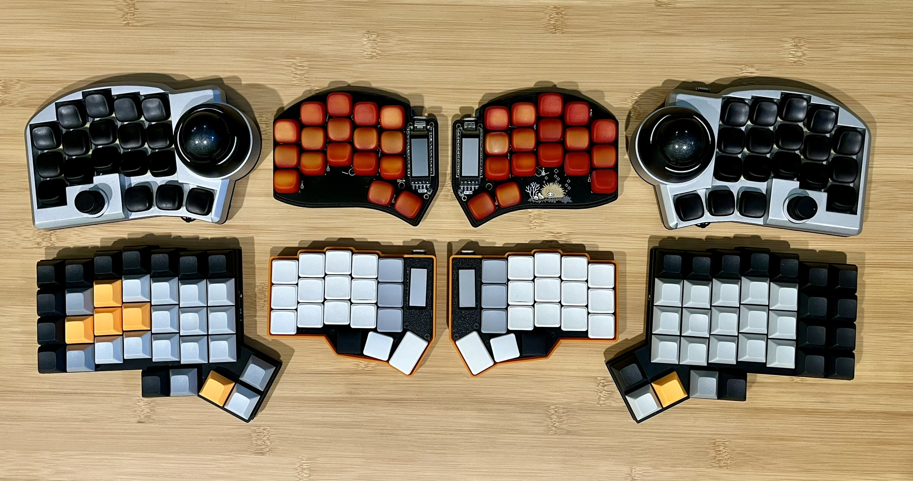

# QMK Config

This repository includes my personal QMK keymaps to build firmware for
keyboards and trackballs:

* [BastardKB Charybdis](keyboards/bastardkb/charybdis/3x5/keymaps/jeffdess/readme.md)
* [Fingerpunch Ximi v2](keyboards/fingerpunch/ximi/v2/keymaps/jeffdess/readme.md)
* [KeyClicks W-Ergolite](keyboards/keyclicks/w_ergolite/keymaps/jeffdess/readme.md) (WIP)
* [Ploopy Nano Trackball](keyboards/ploopyco/trackball_nano/rev1_001/keymaps/jeffdess/readme.md)

> Upper-corners: Ximi - Lower-corners: W-Ergolite - Upper-center: Urchin -
Lower-center: Corne

> [!note]
> Urchin and Corne are not in this repo, but with my [ZMK keyboards](https://github.com/JeffDess/zmk-config).

## Userspace

The keymaps are using [QMK userspace](https://docs.qmk.fm/newbs_external_userspace),
most of the configuration is done on the [`/user`](./users/jeffdess) directory.
So in order to compile, both this repo and a qmk_firmware repo are required.

### Build

1. Run the normal `qmk setup` procedure if you haven't already done so
  -- see [QMK Docs](https://docs.qmk.fm/#/newbs) for details.
1. Clone [my qmk_firmware repository](https://github.com/JeffDess/qmk_firmware).
   It contains base configurations for the keyboards, you must build the user
   space on top of it as the official qmk_firmware doesn't.
1. Clone this repository
1. `cd` into this repository's clone directory
1. Set global userspace path: `qmk config user.overlay_dir="$(realpath .)"`
   -- you MUST be located in the cloned userspace location for this to
   work correctly
     * This will be automatically detected if you've `cd`ed into your userspace
       repository, but the above makes your userspace available regardless of
       your shell location.
1. Compile:
   * `qmk compile -kb fingerpunch/ximi/v2 -km jeffdess`
   * `qmk compile -kb keyclicks/w_ergolite -km jeffdess`
   * `qmk compile -kb ploopyco/trackball_nano/rev1_001 -km jeffdess`

Alternatively, `qmk userspace-compile` to build all of your userspace targets
at once.
