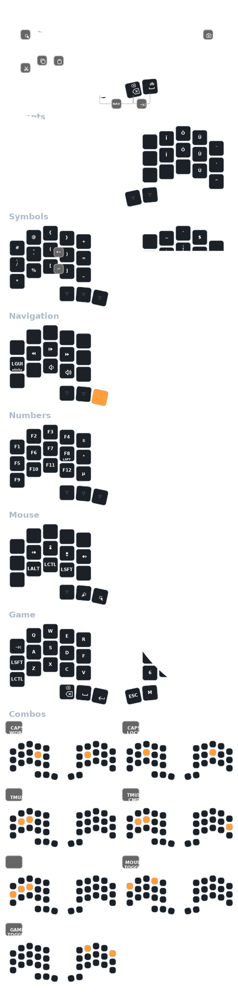

# Charybdis Nano v2

This is my [Charybdis](https://bastardkb.com/charybdis), a 35 keys with:

* Single trackball
* 30-degree tents
* Hotswap MX profile switches

## Keymap

The keymap is optimized for software development and French/English typing.

* [Colemak-DH](https://colemakmods.github.io/mod-dh/) layout
* French and Spanish characters support with dead key and accent layer
* Home row mods
* Mouse keys support
* Gaming Layer (shifted WASD position, free of homerow mods)
* Mnemonic key overrides

> [!NOTE]
> The keymap is programmed over the Canadian Multilingual Standard (CSA)
> base layout.

Also check out my other [ZMK keyboards](https://github.com/JeffDess/zmk-config)
based on the same keymap.
